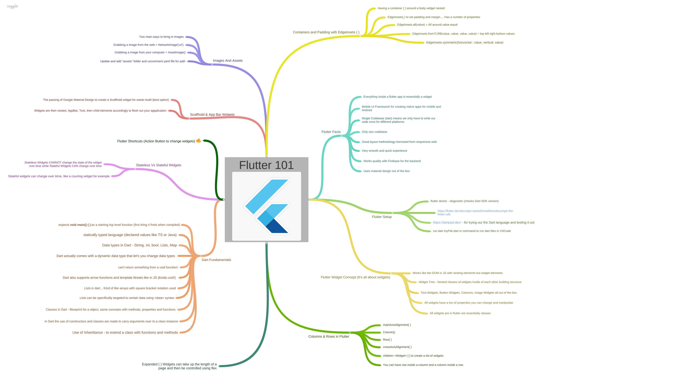

# flutter_primer_for_NCI

A Flutter mobile application for National College Of Ireland (Mobile Dev)
This is a primer for Flutter, syntax and nesting widgets.

## Getting Started

This project is a starting point for a Flutter application.
You gotta need to know the basics first!

# Contents
   -Intro and Setup
   -Dart the Language
   -Android Studio SDK
   -Scaffhold and AppBar Widgets (Material Design)
   -Colors and Fonts
   -Stateless Widgets vs Stateful Widgets (Hot Reloading)
   -Images and Assets
   -Buttons & Icons
   -Containers & Padding
   -Rows
   -Columns
   -Flutter Shortcuts
   -Expanded Widgets
  

A few resources to get you started if this is your first Flutter project:

- [Lab: Write your first Flutter app](https://flutter.dev/docs/get-started/codelab)
- [Cookbook: Useful Flutter samples](https://flutter.dev/docs/cookbook)

For help getting started with Flutter, view our
[online documentation](https://flutter.dev/docs), which offers tutorials,
samples, guidance on mobile development, and a full API reference.
